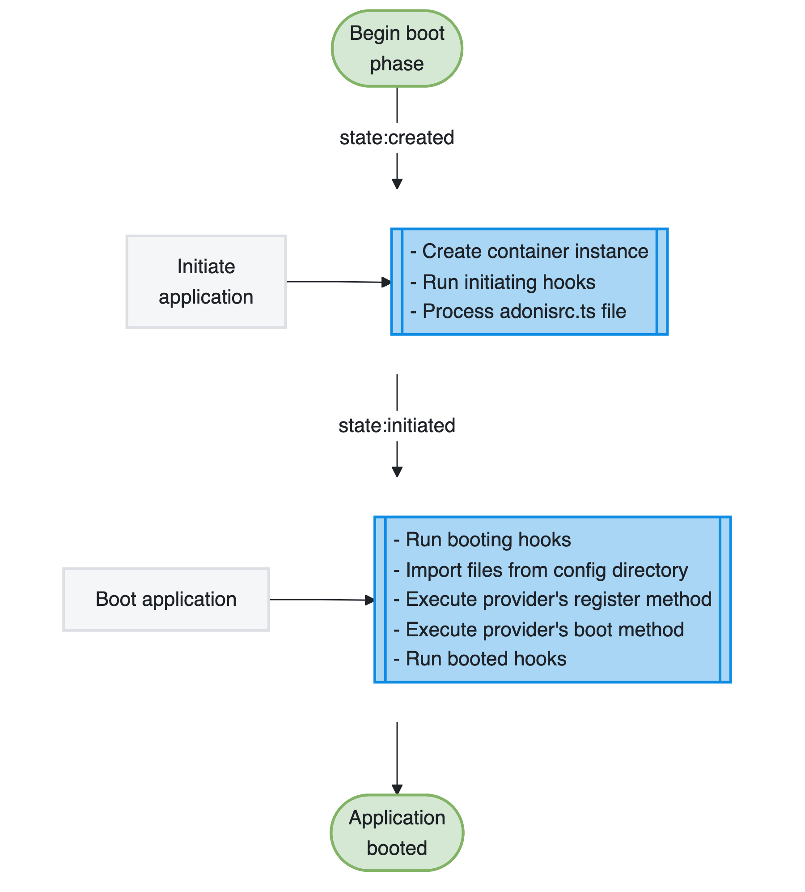
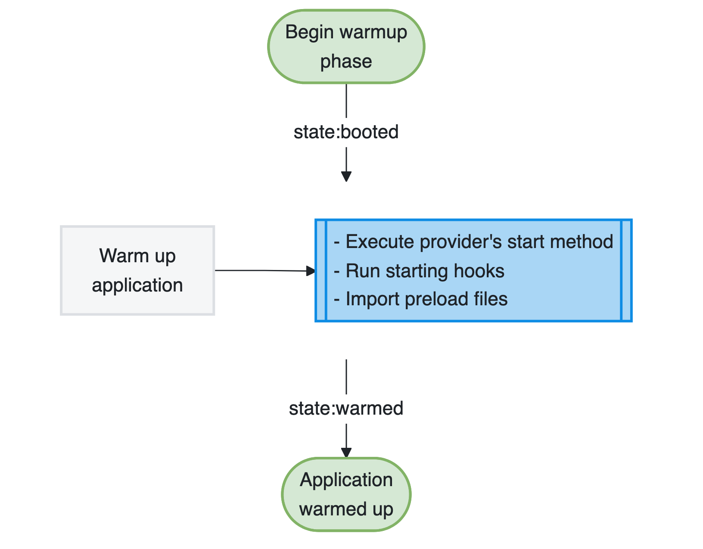
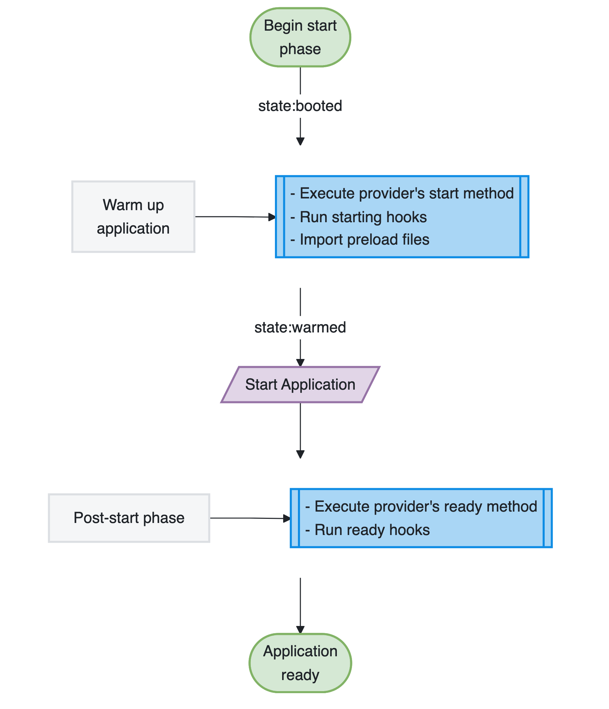
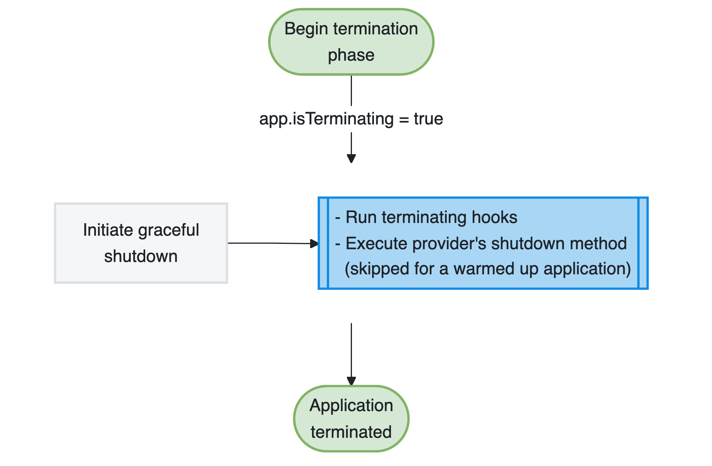

# Application Lifecycle

This guide covers the application lifecycle in AdonisJS. You will learn:

- The four lifecycle phases (boot, warmup, start, and termination)
- When each phase executes and what happens during it
- How to hook into phases using service providers and preload files
- How the application mode lets tooling assemble your app without running it

## Overview

The AdonisJS application lifecycle has four phases: **boot**, **warmup**, **start**, and **termination**. Each phase has a specific role in assembling, running, and shutting down your application.

Understanding the lifecycle helps you place setup and cleanup code correctly. For example, you can register a custom validation rule before the application handles requests and close database connections before the process exits.

The lifecycle moves from boot to warmup to start, followed by termination when the process receives a shutdown signal. This predictable order lets you run setup and cleanup code at the appropriate time.

## Boot phase

The boot phase is the initial stage where AdonisJS prepares your application for execution. During this phase, you can use the IoC container to fetch bindings and extend parts of the framework.

Service providers register their bindings into the container and execute their `boot` methods. The framework itself is being configured, but your application isn't yet ready to handle requests or execute commands.

The boot phase completes before providers start and preload files are imported.

:::media

:::

## Warmup phase

The warmup phase assembles your application. AdonisJS executes the `start` method of every service provider, runs the `starting` hooks, and imports the preload files.

Application-specific registration happens here. Routes are registered, event listeners are attached, and named middleware become available. By the end of this phase your application is complete, but nothing has been asked to run yet.

:::media

:::

The phase is environment-aware, meaning you can load different providers and preload files for the HTTP server, Ace commands, tests, and the REPL. AdonisJS imports all preload files configured for the current environment in parallel.

The order matters. Providers are started before the preload files are imported, so a preload file can rely on whatever a provider established in its `start` method. For example, `@adonisjs/queue` initializes its queue manager during `start`, which is what allows the `start/scheduler.ts` preload file to schedule jobs against it.

## Start phase

The start phase is where your application comes to life. AdonisJS warms up the application first, then starts it, and finally executes the `ready` method of every service provider.

By the end of this phase, your application is fully operational and ready to handle HTTP requests, execute Ace commands, or run tests depending on the environment.

:::media

:::

Warming up is a part of starting, so you never have to trigger it yourself when you run your application. Tooling that only needs to inspect your application stops at the end of the warmup phase instead. See [application modes](#application-modes).

## Termination phase

The termination phase happens when AdonisJS begins graceful shutdown. This usually occurs when the process receives a `SIGINT` or `SIGTERM` signal, such as when you stop the development server or replace an application instance during deployment.

During this phase, service providers execute their `shutdown` methods, allowing them to perform cleanup operations like closing database connections, flushing logs, or canceling pending background jobs.

:::media

:::

Graceful shutdown ensures your application stops cleanly rather than abruptly terminating mid-operation, helping prevent data corruption.

AdonisJS skips provider `shutdown` methods when an application runs in `warmup` mode. Therefore, providers must not open long-lived resources during warmup.

## Application modes

Every application is created with a mode that declares how far it intends to travel within its lifecycle. The default `run` mode takes the application all the way to the ready state. The `warmup` mode stops at the end of the warmup phase, which is what tooling uses to inspect your application without running it.

The `node ace codegen` command uses the `warmup` mode to read your routes and generate their types. It needs your application assembled, but it must not start an HTTP server, spawn queue workers, or open a database connection while doing so.

Use the mode inside a service provider to skip work that only makes sense for an application that runs. For example, the following provider avoids creating or updating its recurring schedule while codegen inspects the application.

```ts title="providers/scheduler_provider.ts"
import CleanupExpiredSessions from '#jobs/cleanup_expired_sessions'
import type { ApplicationService } from '@adonisjs/core/types'

export default class SchedulerProvider {
  constructor(protected app: ApplicationService) {}

  async start() {
    if (this.app.getMode() !== 'run') {
      return
    }

    await CleanupExpiredSessions.schedule({ retentionDays: 30 })
      .id('cleanup-expired-sessions')
      .cron('0 0 * * *')
      .timezone('UTC')
      .run()
  }
}
```

## Hooking into lifecycle phases

You can hook into different lifecycle phases using service providers and preload files. Service providers offer the `boot`, `start`, `ready`, and `shutdown` methods, while preload files run during warmup.

### Hooking into the boot phase

Use the `boot` method in a service provider to execute code during the boot phase. This is where you should extend the framework or configure services that other parts of your application depend on.

The following provider extends VineJS with a `phoneNumber` validation rule. Since the macro is registered during boot, the rule is available when your application creates validators.

```ts title="providers/app_provider.ts"
import vine, { VineString } from '@vinejs/vine'
import type { ApplicationService } from '@adonisjs/core/types'

declare module '@vinejs/vine' {
  interface VineString {
    phoneNumber(): this
  }
}

const phoneNumberRule = vine.createRule(function phoneNumber(value, _, field) {
  if (typeof value !== 'string') {
    return
  }

  if (!/^\d{10}$/.test(value)) {
    field.report('The {{ field }} must be a valid 10-digit phone number', 'phoneNumber', field)
  }
})

export default class AppProvider {
  constructor(protected app: ApplicationService) {}

  async boot() {
    VineString.macro('phoneNumber', function (this: VineString) {
      return this.use(phoneNumberRule())
    })
  }
}
```

### Hooking into the warmup and start phases

Use a provider's `start` method or a preload file for code that assembles the application during warmup. Use the provider's `ready` method for operational work that should begin only after the application has started.

#### Using service provider methods

The `start` method executes during warmup, before preload files are imported. The `ready` method executes once the application has started and is ready to handle requests or commands. The following provider guards a database health check in `start` because the check must not run during codegen, and uses `ready` for work that begins after startup.

```ts title="providers/app_provider.ts"
import type { ApplicationService } from '@adonisjs/core/types'

export default class AppProvider {
  constructor(protected app: ApplicationService) {}

  async start() {
    if (this.app.getMode() !== 'run') {
      return
    }

    const database = await this.app.container.make('lucid.db')
    await database.connection().select(1)
  }

  async ready() {
    const logger = await this.app.container.make('logger')
    logger.info('Application is ready')
  }
}
```

#### Using preload files

Preload files offer a simpler way to assemble application-specific behavior without creating a service provider. They are ideal for registering routes, attaching event listeners, and configuring middleware.

Create a preload file using the `make:preload` command.

```sh title="terminal"
node ace make:preload events
```

This command creates a new file in the `start` directory and automatically registers it in your `adonisrc.ts` configuration file.

```ts title="start/events.ts"
import emitter from '@adonisjs/core/services/emitter'
import logger from '@adonisjs/core/services/logger'

emitter.on('user:registered', function (user) {
  logger.info({ userId: user.id }, 'New user registered')
})

emitter.on('order:placed', function (order) {
  logger.info({ orderId: order.id }, 'New order placed')
})
```

You can configure preload files to load only in specific runtime environments.

```ts title="adonisrc.ts"
import { defineConfig } from '@adonisjs/core/app'

export default defineConfig({
  preloads: [
    () => import('#start/routes'),
    () => import('#start/kernel'),
    {
      file: () => import('#start/events'),
      environment: ['web', 'console']
    }
  ]
})
```

The `environment` property accepts an array of values: `web` (HTTP server), `console` (Ace commands), `test` (test runner), and `repl` (REPL environment).

### Hooking into the termination phase

Use the `shutdown` method in a service provider to execute cleanup operations during graceful shutdown. This ensures resources are properly released before your application terminates.

```ts title="providers/app_provider.ts"
import type { ApplicationService } from '@adonisjs/core/types'

export default class AppProvider {
  constructor(protected app: ApplicationService) {}

  async shutdown() {
    const redis = await this.app.container.make('redis')
    await redis.quitAll()
  }
}
```

## See also

- [Service providers guide](./service_providers.md) for creating providers and using their lifecycle hooks
- [AdonisRC file reference](../../reference/adonisrc_file.md) for configuring preload files and other application settings
